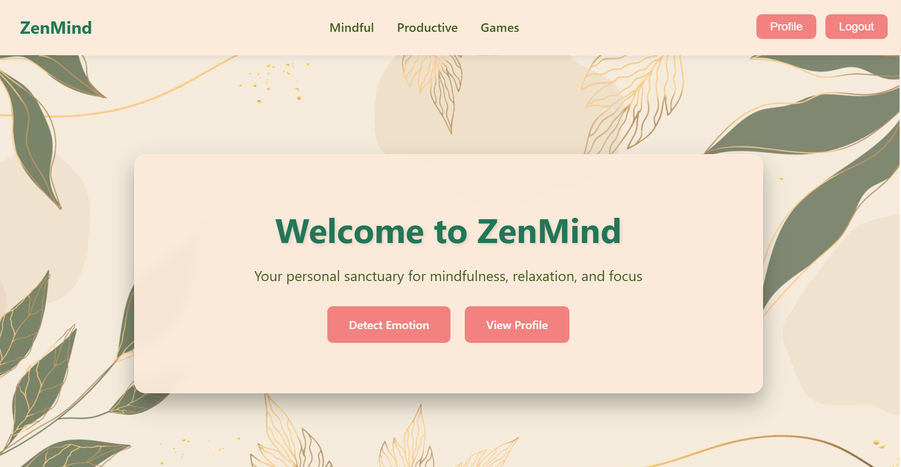
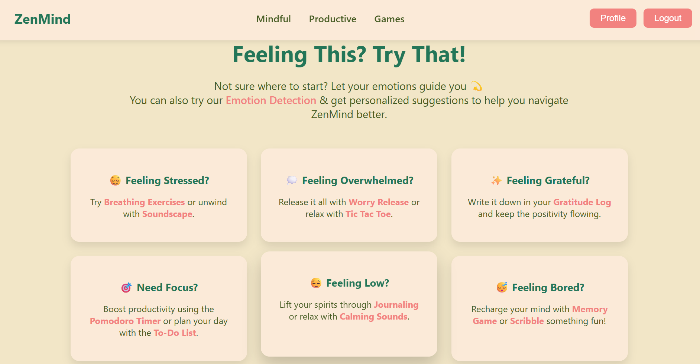
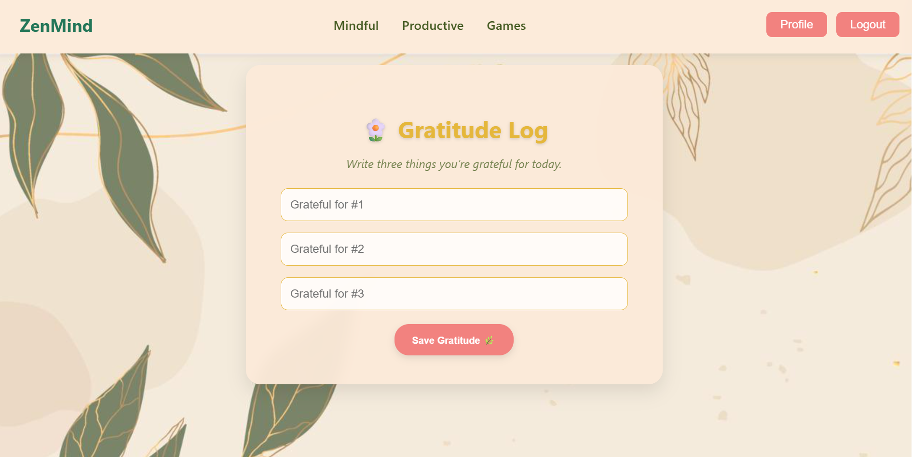
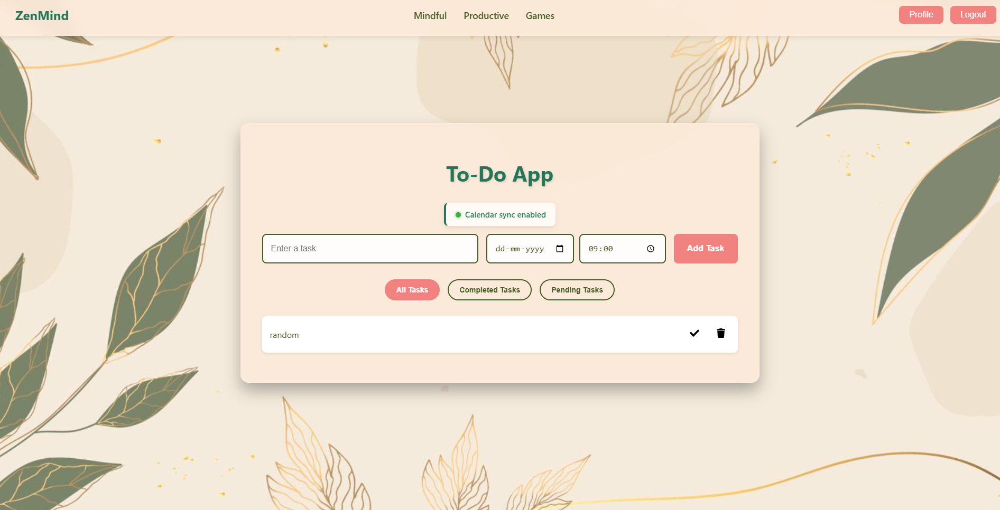
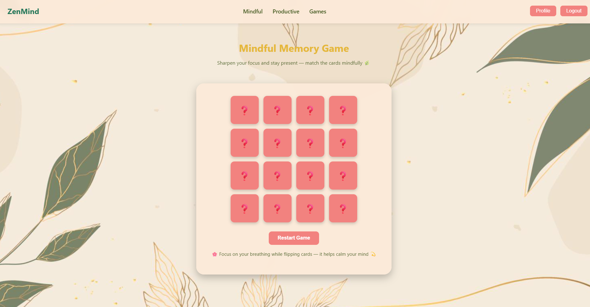

## 🌿 ZenMind Application Preview

ZenMind provides a seamless, interactive experience for mindfulness, productivity, and emotional well-being.  
Below are some in-app previews showcasing key sections.




---

### 🧘 Mindful Tools
Explore relaxation and emotional wellness tools including **Worry Release**, **Gratitude Log**, **Journal**, **Soundscape**, and **Meditation Timer**.  
These help users de-stress, reflect, and stay calm.



---

### ⚡ Productive Tools
Stay organized and focused with the **To-Do List** and **Pomodoro Timer**.  
Designed to balance mindfulness with productivity.



---

### 🎮 Mindful Games
Engage in light, fun activities like:
- Memory
- Sudoku
- Tic Tac Toe
- Scribble
- Breakout
- Clicker
- 2048
- Maze
- Snake
- Flappy Bird
- Sliding Puzzle

These promote focus and mental agility while keeping relaxation in mind.



---

### 👤 Profile & Rewards
Track your progress, journaling streaks, and emotional journey.  
Unlock rewards and badges as you maintain mindfulness consistency.


---

### 📅 Activities & Mood Journey
Visualize your **Yearly Mood Journey** and journal activity trends.  
Helps users reflect on emotional patterns and personal growth.


---


## ⚙️ Installation & Setup

### 🧱 Prerequisites
Ensure the following are installed:
- Node.js (v16+)
- npm (v8+)
- MongoDB (local or Atlas)

---

### 🪄 Setup Steps


1️⃣ Clone the Repository
```bash
git clone https://github.com/vaidikapadigela/ZenMindApp.git
cd zenmind
```

2️⃣ Install Dependencies
Frontend:
```bash
cd zenmind_frontend
npm install
```

Backend:
```bash
cd ../backend
npm install
```

3️⃣ Create Environment Variables
Create a .env file inside your backend folder (zenmind_backend/) and add the following:
```bash
PORT=5000
MONGO_URI=your_mongodb_connection_string
GOOGLE_CLIENT_ID=your_google_client_id
GOOGLE_CLIENT_SECRET=your_google_client_secret
JWT_SECRET=your_jwt_secret
CLIENT_URL=http://localhost:3000
```

4️⃣ Start the Application
Run both backend and frontend servers in separate terminals:

Terminal 1 - Start Backend
```bash
cd zenmind_backend
npm start
```

Terminal 2 - Start Frontend
```bash
cd zenmind_frontend
npm start
```

Then open your browser and go to 👉
```bash
http://localhost:3000
```


Backend (API) → http://localhost:5000

Connected MongoDB Database

Google Authentication enabled (if configured properly)

